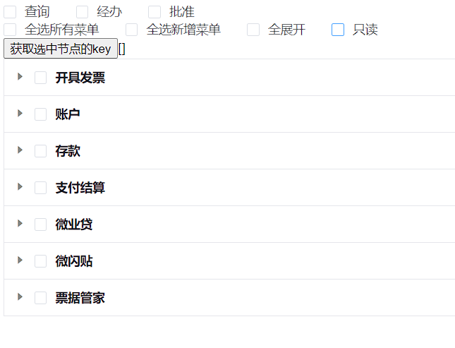
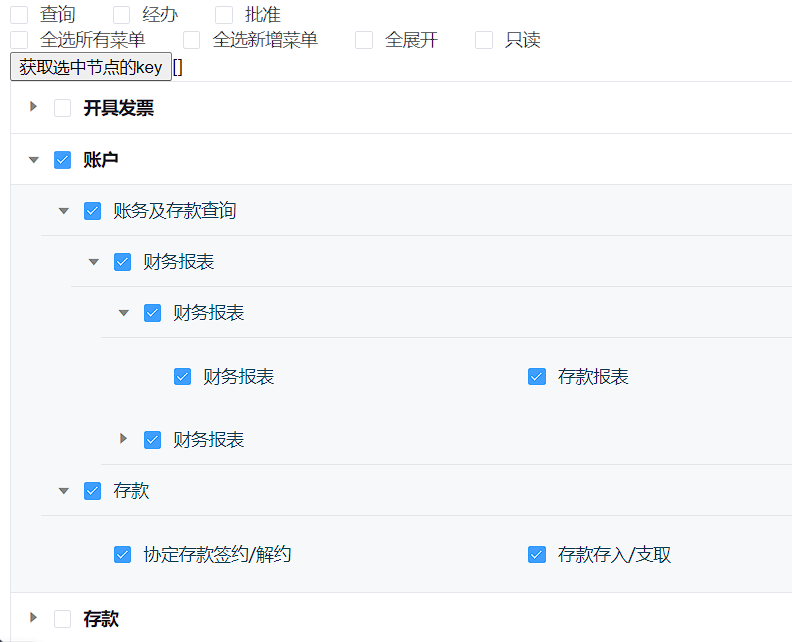

### 介绍
这是一个基于vue@2.6.14开发的自定义树形组件，其展示效果类似于表格，可以多层嵌套,拥有流畅的展开过渡动画。

### 效果展示

### 参数
参数|说明|类型|默认值
-|-|-|-|
data|显示的数据|array|[]
readOnly|是否只读|boolean|false
defaultCheckedKeys|默认勾选的节点的 key 的数组|array|--
defaultExpandedKeys|默认展开的节点的 key 的数组|array|--
nodeKey|每个树节点用来作为唯一标识的属性，整棵树应该是唯一的|string|id
autoExpandParent|展开子节点的时候是否自动展开父节点|boolean|true
defaultExpandAll|是否默认展开所有节点|boolean|false
lineNum|叶子节点横排数|number|3
indent|子节点的缩进|number|24(像素)
props|配置选项，具体看下表|object|--

### props
参数|说明|类型|默认值
-|-|-|-|
children|指定子树为节点对象的某个属性值|string|children
label|指定节点标签为节点对象的某个属性值|string|label
disabled|指定节点选择框是否禁用为节点对象的某个属性值|string|disabled

### 方法
方法名|说明|参数
-|-|-
getCheckedKeys|获取选中节点的key|接受一个boolean类型的参数，表示是否只包含叶子节点，默认值为 false
getCheckedNodes|获取选中的节点对象|接收两个boolean类型的参数，1. 是否只是叶子节点，默认值为 false 2. 是否包含半选节点，默认值为 false
getHalfCheckedNodes|获取半选中节点|--
getHalfCheckedKeys|获取半选中节点的key|--
setKeys|设置选中或取消的节点|接收三个参数，1. 勾选节点的 key 2. boolean 类型，节点是否选中 3. boolean 类型，是否设置子节点 ，默认为 false
setAll|全选/全取消|接收两个参数，1. boolean 类型，节点是否选中 2. boolean 类型，是否设置子节点
setExpandedKeys|设置展开/折叠|接收两个参数，1. 勾选节点的 key 2. boolean 类型，节点是否展开
setExpandedAll|设置所有展开/折叠|接受一个boolean类型的参数，表示是否展开
